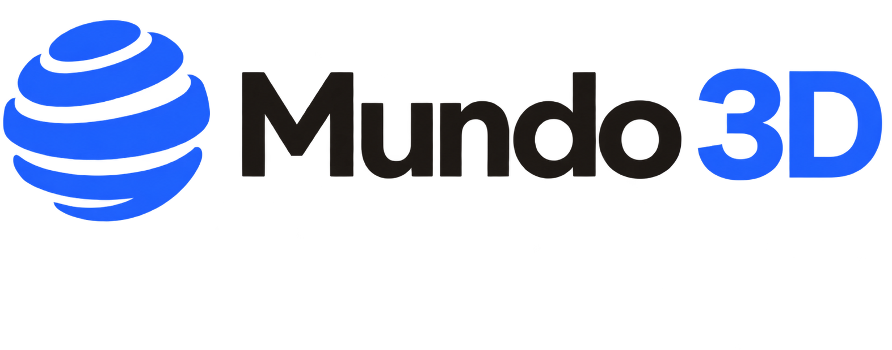
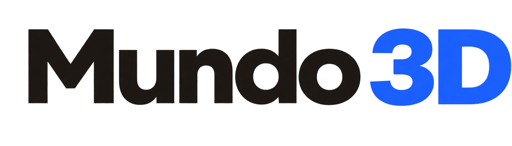
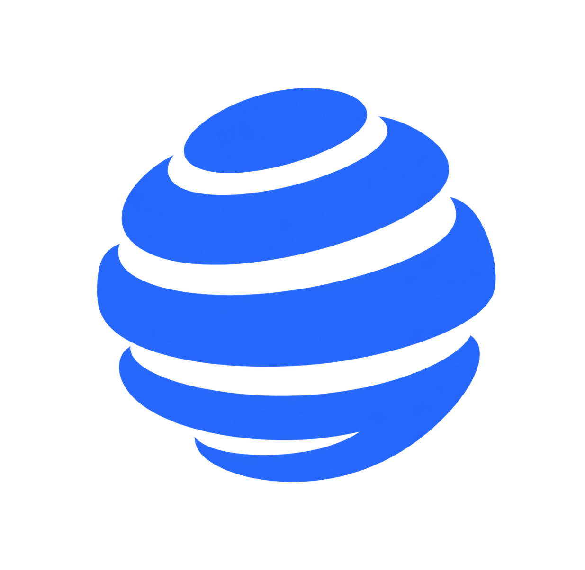
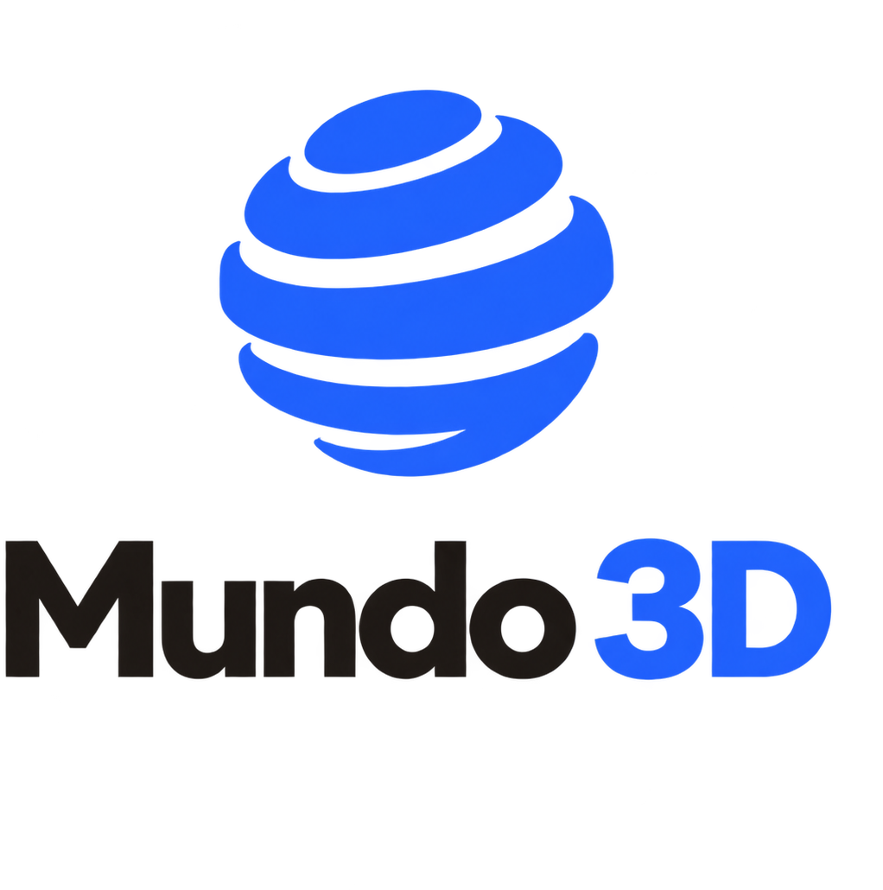

## 1. Propósito y autoridad

Este manual define la identidad de **Mundo 3D** y es la fuente principal para decisiones de marca. Aplica a producto digital, comunicaciones, documentos y materiales derivados.

`DESIGN.md` traduce estas normas a criterios técnicos y registra su estado de implementación. No reemplaza este manual. El repositorio de producción determina qué está implementado, sin convertir una excepción técnica en una regla de marca.

Este documento no define componentes, breakpoints, arquitectura frontend ni tokens de implementación. Esos detalles corresponden a `DESIGN.md`.

Esta versión es **0.1**. Los cinco activos PNG de identidad —las cuatro variantes base y el isologotipo inverso— están aprobados para los usos definidos en este manual.

## 1.1. Personalidad

Mundo 3D es un taller que muestra piezas impresas. La marca debe transmitir:

- **Criterio:** la superficie se ve cuidada porque el trabajo por detrás también lo está.
- **Honestidad:** no se promete stock, pago ni encargos que el producto no tenga.
- **Oficio:** las figuras cargan el color; la interfaz se calla.
- **Claridad:** un evaluador entiende el catálogo en minutos.
- **Cercanía:** voz rioplatense de _vos_, directa, sin slogan de tienda genérica.

## 1.2. Nombre

Nombre de marca: **Mundo 3D**. En wordmark, `Mundo` en peso 400 y `3D` en peso 600. No usar `Mundo-3D` ni `MUNDO 3D` en piezas de marca, salvo identificadores técnicos de repositorio.

\newpage

## 2. Sistema de logotipos

Existen cuatro variantes principales y un activo inverso del isologotipo. Deben usarse desde los activos indicados, sin reconstruirlas ni separar sus partes.

## 2.1. Variantes y contextos

### Isologotipo: icono y texto horizontal

Variante principal para encabezados, pies y comunicaciones con ancho suficiente.

### Logotipo: texto

Para espacios horizontales donde la marca ya está contextualizada y el icono no es necesario.

Usar el PNG aprobado. No reconstruir el wordmark con otra fuente ni separar partes del activo.

### Isotipo: icono

Tres capas apiladas, como una pieza impresa. Para favicon, avatar y espacios reducidos. Si el contexto no nombra a Mundo 3D, debe haber un nombre accesible o visible.

### Imagotipo: icono y texto apilado

Para composiciones verticales, presentaciones y piezas centradas.

## 2.2. Normas dimensionales

| Variante    |                                                      Digital |              Impreso |
| ----------- | -----------------------------------------------------------: | -------------------: |
| Isologotipo |                                        ancho mínimo `140 px` | ancho mínimo `35 mm` |
| Logotipo    |                                        ancho mínimo `120 px` | ancho mínimo `30 mm` |
| Isotipo     | sin mínimo de marca; usar el tamaño que preserve legibilidad |  ancho mínimo `8 mm` |
| Imagotipo   |                                         ancho mínimo `96 px` | ancho mínimo `24 mm` |

Estas medidas son los mínimos aprobados. Si el texto o la forma pierden definición, debe usarse un tamaño mayor. El área interactiva accesible se define por separado en §8.

## 2.3. Espacio de seguridad y fondos

La unidad **x** equivale a la altura de la letra mayúscula “M” del logotipo renderizado. Debe mantenerse al menos `1x` libre en los cuatro lados.

Fondos permitidos:

- Papel `#F6F2EA` o superficie `#FFFDF9`, sin patrones.
- Blanco.
- Fotografías sólo cuando exista un área uniforme y el logo conserve separación clara.
- Tinta `#1E1B18` sólo con los activos base.
- Superficies oscuras sólo con el activo inverso oficial `Mundo3D_Isologotipo_Inverso.png`; no simularlo con CSS ni filtros.

## 2.4. Uso correcto e incorrecto

Correcto: elegir la variante según el espacio; mantener proporción y color; respetar las medidas orientativas y el espacio de seguridad; usar el archivo de `imagenes/`.

Incorrecto: estirar, recortar, recolorear, agregar sombra o contorno, reconstruir el wordmark con otra fuente, usar naranja, o volver al globo tipo telecom.

\newpage

## 3. Paleta cromática

Siete roles. El acento es azul de marca, no naranja. Las fotos del catálogo siguen llevando el color de las piezas; el azul es marca y acción, no relleno de cards.

| Rol          | Nombre    |       Hex | Uso principal                   |
| ------------ | --------- | --------: | ------------------------------- |
| Tinta        | Ink       | `#1E1B18` | “Mundo”, títulos, texto         |
| Apagado      | Muted     | `#6A635B` | Texto secundario                |
| Línea        | Line      | `#DED7CD` | Bordes                          |
| Papel        | Paper     | `#F6F2EA` | Fondo de página                 |
| Superficie   | Surface   | `#FFFDF9` | Cards, header                   |
| Acento       | Blue      | `#2F6BFF` | Isotipo, “3D”, botones de marca |
| Acento suave | Blue soft | `#DCE7FF` | Hover y fondos secundarios      |

No reintroducir naranja ni crimson PICO-8.

## 3.1. Contraste

Ratios sRGB WCAG. Texto normal: `4.5:1`. Texto grande o gráfico esencial: `3:1`.

| Frente / fondo     |     Ratio | Norma                                       |
| ------------------ | --------: | ------------------------------------------- |
| Tinta / papel      | `15.35:1` | Texto normal                                |
| Tinta / superficie | `16.87:1` | Texto normal                                |
| Apagado / papel    |  `5.30:1` | Texto normal                                |
| Azul / papel       |  `4.03:1` | Texto grande o gráfico; no cuerpo           |
| Blanco / azul      |  `4.50:1` | Texto en botón de acento                    |
| Línea / papel      |  `1.28:1` | Sólo borde; nunca texto ni control esencial |

El color nunca es la única señal de estado.

## 3.2. Marcas externas

Los colores de redes o servicios externos valen sólo en su icono o acción identificable. No amplían esta paleta.

## 3.3. Modo oscuro

El producto puede tener un tema oscuro de taller nocturno. **No hay paleta oscura de marca aprobada en 0.1.** Los tokens oscuros del producto no redefinen la paleta de marca. Cuando el isologotipo aparezca sobre una superficie oscura, usar `Mundo3D_Isologotipo_Inverso.png`; no recolorear el activo base.

\newpage

## 4. Tipografía

**IBM Plex Sans** es la tipografía oficial de marca y producto.

| Rol     | Tamaño mínimo |  Peso | Interlineado |
| ------- | ------------: | ----: | -----------: |
| Display |       `40 px` | `600` |       `1.10` |
| H1      |       `32 px` | `600` |       `1.20` |
| H2      |       `24 px` | `600` |       `1.25` |
| Body    |       `16 px` | `400` |       `1.50` |
| Label   |       `14 px` | `500` |       `1.40` |
| Caption |       `12 px` | `400` |       `1.40` |

Pesos habituales: `400`, `500` y `600`. No usar Press Start 2P ni VT323 en piezas de marca. Carga esperada: archivos del producto o fuente aprobada, con `font-display: swap` y fallbacks `system-ui`, `-apple-system`, `"Segoe UI"`, `sans-serif`.

## 5. Fotografía

La fotografía debe mostrar las piezas reales del catálogo.

- Usar las imágenes del repositorio (`frontend/public/img/products/`), no stock ni escenas inventadas.
- Luz de taller creíble; no recortar la pieza hasta que parezca un render genérico.
- No usar Mario, Batman u otras franquicias como _skin_ de la marca: son el inventario, no el isotipo.
- No fabricar clientes, testimonios ni fotos de “envíos felices”.

## 6. Iconografía

Lucide es la dirección de iconos de interfaz.

- Vectoriales, `16`, `20` o `24 px`, trazo consistente en el mismo nivel.
- Etiqueta accesible cuando no hay texto visible.
- No emoji como chrome. No iconos pixel art.

## 7. Voz y tono

La voz es rioplatense, de _vos_, clara y sin inflar. Información concreta y una acción siguiente cuando exista.

| Contexto | Regla                             | Ejemplo                                                       |
| -------- | --------------------------------- | ------------------------------------------------------------- |
| CTA      | Verbo y resultado                 | “Ver el catálogo”                                             |
| Encargo  | No simular un flujo que no existe | “Encargo a medida” apunta a ayuda, no a un pago               |
| Error    | Problema y cómo seguir            | “No se pudo cargar. Verificá la conexión e intentá de nuevo.” |
| Vacío    | Estado verdadero                  | “Todavía no hay piezas en el catálogo.”                       |

Prohibido: “Calidad premium garantizada”, “Envío en tiempo récord”, “Soporte 24/7” u otra promesa no verificable.

\newpage

## 8. Accesibilidad de marca

- WCAG AA: `4.5:1` texto normal, `3:1` texto grande y gráfico esencial.
- No comunicar estado sólo con color.
- Foco de teclado visible. Área mínima `44 x 44 px`.
- Logo a inicio: nombre accesible “Mundo 3D — Inicio”. No repetir “logo de” en el alt.

## 9. Gobernanza

| Campo              | Valor                                                                          |
| ------------------ | ------------------------------------------------------------------------------ |
| Versión            | `0.1`                                                                          |
| Fecha              | Septiembre 2026                                                                |
| Estado             | Identidad visual aprobada; cinco activos PNG aprobados para los usos definidos |
| Fuente principal   | `docs/diseno/manual-identidad.md`                                              |
| Traducción técnica | `DESIGN.md`                                                                    |

## 9.1. Jerarquía de autoridad

1. Este manual define la identidad.
2. `DESIGN.md` traduce estas normas a criterios técnicos y registra deuda.
3. `docs/diseno/identidad-visual.html` resume visualmente la identidad aprobada.
4. Los cinco activos PNG de `docs/diseno/imagenes/` materializan los logos y variantes aprobados.
5. El código prueba qué está implementado; no redefine la marca.

## 9.2. Proceso de cambio

Un cambio normativo requiere revisión de marca. Un cambio técnico subordinado se registra en `DESIGN.md`. No presentar trabajo futuro como implementado.

## 10. Recursos y límites

| Recurso             | Documentación                                          | Frontend                                                                       |
| ------------------- | ------------------------------------------------------ | ------------------------------------------------------------------------------ |
| Isologotipo         | `docs/diseno/imagenes/Mundo3D_Isologotipo.png`         | `frontend/public/img/brand/Mundo3D_Isologotipo.png`                            |
| Isologotipo inverso | `docs/diseno/imagenes/Mundo3D_Isologotipo_Inverso.png` | `frontend/public/img/brand/Mundo3D_Isologotipo_Inverso.png`                    |
| Logotipo            | `docs/diseno/imagenes/Mundo3D_Logotipo.png`            | `frontend/public/img/brand/Mundo3D_Logotipo.png`                               |
| Imagotipo           | `docs/diseno/imagenes/Mundo3D_Imagotipo.png`           | `frontend/public/img/brand/Mundo3D_Imagotipo.png`                              |
| Isotipo             | `docs/diseno/imagenes/Mundo3D_Isotipo.png`             | `frontend/public/img/brand/Mundo3D_Isotipo.png`                                |
| Favicon             | —                                                      | `frontend/public/img/brand/Mundo3D_Favicon.png`; `frontend/public/favicon.ico` |

Este manual no cubre componentes, breakpoints ni estados interactivos. Consultar `DESIGN.md`.
