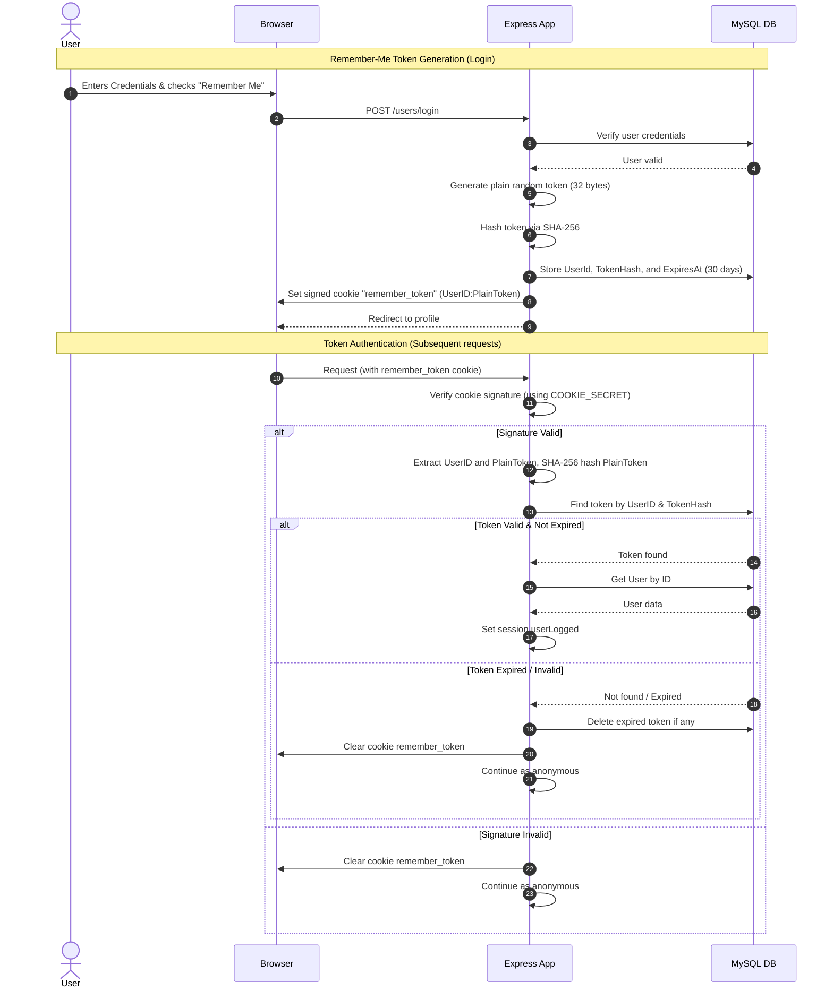

# Design: Auth Hardening and Cleanup

## Technical Approach
Secure the remember-me flow by replacing plaintext email cookies with cryptographically signed and hashed session tokens. We will define a `RememberToken` model associated with the `User` model, parse cookies via `cookie-parser` using `process.env.COOKIE_SECRET`, and silently invalidate expired or invalid tokens. CORS is locked down using `process.env.CORS_ORIGIN`, absolute view paths are removed, `ProductService.update` is expanded, and `processLogin` error rendering is simplified.

## Architecture Decisions

| Decision | Options | Tradeoffs | Rationale |
|---|---|---|---|
| **Token Storage** | Plaintext in DB vs SHA-256 Hashing | Plaintext allows easier debugging but exposes sessions if DB is breached. SHA-256 is secure against DB leakage. | **SHA-256 Hash**: Hash tokens before database entry; pass plain token via signed cookie. |
| **Database Migration** | Manual SQL vs `sequelize.sync()` | Manual SQL requires a runner. `sequelize.sync()` is already integrated into the app boot sequence (`index.js`). | **Idempotent `sequelize.sync()`**: Leverage the existing initialization sequence to automatically create the new table. |
| **CORS Restrictions** | Wildcard `*` vs Origin Whitelist | Wildcard is insecure. Whitelist requires manual configuration but ensures security. | **Environment Whitelist**: Restrict CORS using `process.env.CORS_ORIGIN`, defaulting to `http://localhost:3000` if unset. |

## Data Flow



## File Changes

| File | Action | Description |
|------|--------|-------------|
| `src/database/models/RememberToken.js` | Create | Define model schema (`id`, `IDUser`, `TokenHash`, `ExpiresAt`). |
| `src/database/models/index.js` | Modify | Load `RememberToken` and establish `User hasMany RememberToken` association. |
| `src/services/userService.js` | Modify | Add `createRememberToken`, `verifyRememberToken`, and `deleteRememberToken`. |
| `src/middlewares/userLogged.js` | Modify | Read signed `remember_token` cookie, authenticate via DB, or clear invalid cookies. |
| `src/controllers/users/processLogin.js` | Modify | Save hashed token in DB, set signed cookie on login, and unify credential error views. |
| `src/controllers/users/logout.js` | Modify | Delete token from database and clear `remember_token` cookie. |
| `src/app.js` | Modify | Initialize `cookie-parser` with `process.env.COOKIE_SECRET` and set CORS origin whitelist. |
| `src/services/productService.js` | Modify | Update `ProductService.update` to persist `Image`, `IDCategory`, and `IDFranchise`. |
| Multiple Controllers | Modify | Remove `path.join(__dirname, ...)` from `res.render(...)` calls. |

## Interfaces / Contracts

```javascript
// RememberToken Schema (Sequelize)
const RememberToken = sequelize.define('RememberToken', {
  id: { type: DataTypes.INTEGER, primaryKey: true, autoIncrement: true },
  IDUser: { type: DataTypes.INTEGER, allowNull: false },
  TokenHash: { type: DataTypes.STRING(64), allowNull: false, unique: true },
  ExpiresAt: { type: DataTypes.DATE, allowNull: false }
});

// UserService additions
async createRememberToken(userId, plainToken, durationSeconds) // hashes and saves token
async verifyRememberToken(plainToken) // returns User if token valid; deletes token if expired
async deleteRememberToken(plainToken) // deletes token on logout
```

## Testing Strategy

| Layer | What to Test | Approach |
|-------|-------------|----------|
| **Unit** | `UserService` remember token methods | Verify SHA-256 token hashing, creation in DB, validation, and silent deletion when expired. |
| **Integration** | `userLogged` middleware | Mock `req.signedCookies.remember_token` and DB records to test auto-login and cookie deletion. |
| **Integration** | CORS Whitelisting | Request from authorized and unauthorized origins to verify response headers. |

## Migration / Rollout
Since `index.js` runs `db.sequelize.sync()` on boot, Sequelize will automatically issue an idempotent `CREATE TABLE IF NOT EXISTS RememberToken (...)` query. No manual migration scripts are needed.

## Open Questions
- None.
