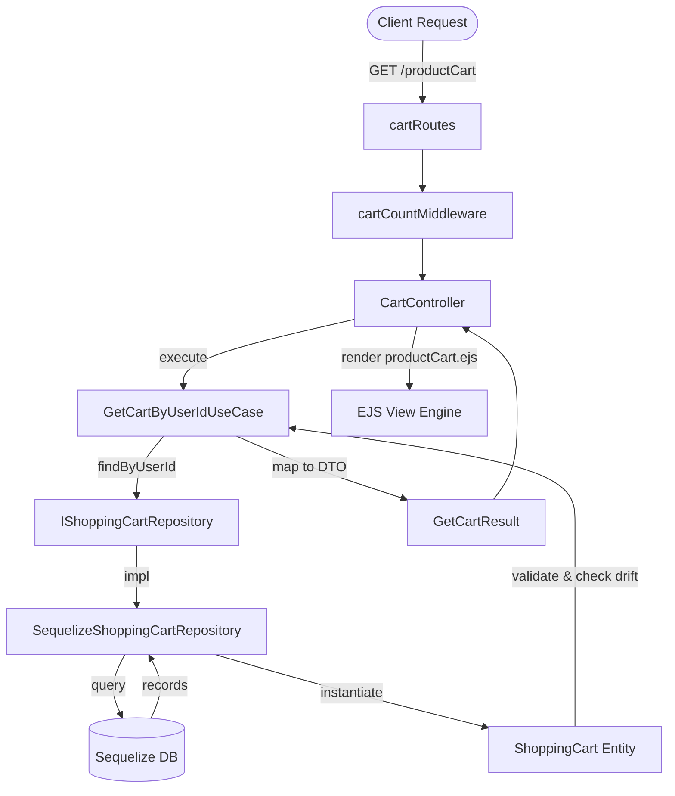

# Design: Cart Module Migration

## Technical Approach
We will migrate the legacy JS cart module to TS using Hexagonal Architecture. The core domain entity (`ShoppingCart`) will enforce cart status, quantity validation, and price drift detection. A dedicated Sequelize repository adapter will implement the repository port. Use cases will encapsulate the query operations, compute the cart total, and map outputs to an EJS-compatible DTO structure. A new TS controller, middleware, and router will handle HTTP operations, mounted modularly in `app.js`.

## Architecture Decisions
| Decision / Option | Tradeoff | Choice & Rationale |
|---|---|---|
| **Approach A**: Dedicated `cartRoutes.ts` router vs **Approach B**: Embedding cart controller in `productRoutes.ts` | Approach B avoids modifying `app.js` but couples Cart to Product. Approach A requires a new router and `app.js` mount, but decouples the domains completely. | **Approach A**: Decouples the Cart domain from Product, facilitating future modifications and aligning with Hexagonal architecture. |
| **Use Case Output**: `GetCartResult` containing both items and total vs separate computation | Separate controller calculation violates spec requirements. Pre-calculating in the use case keeps controllers thin. | **GetCartResult DTO**: The use case/mapper calculates the total, preventing inline math in the controller. |
| **DTO Mapping**: EJS-compatible PascalCase fields vs standard camelCase TS entities | Using camelCase requires rewriting EJS views. Mapping to PascalCase DTO preserves views with zero template edits. | **PascalCase DTO**: Preserves compatibility with existing EJS templates (`cartItem.product.NameProduct`, `cartItem.UnitPrice`, `cartItem.Quantity`). |

## Data Flow


## File Changes
| File | Action | Description |
|------|--------|-------------|
| `src/domain/entities/ShoppingCart.ts` | Create | Domain entity for cart items. Defines `CartStatus` enum (`ACTIVE`, `ORDERED`, `ABANDONED`) and drift detection. |
| `src/domain/ports/IShoppingCartRepository.ts` | Create | Repository port interface defining queries. |
| `src/domain/exceptions/CartValidationException.ts` | Create | Custom domain validation exception. |
| `src/application/dtos/ShoppingCartDTO.ts` | Create | DTO contract and mapper function mapping entity to PascalCase for EJS compatibility. |
| `src/application/use-cases/GetCartByUserIdUseCase.ts` | Create | Use case to retrieve user cart items, detect price drift, compute total, and return the DTO. |
| `src/application/use-cases/GetCartDistinctCountUseCase.ts` | Create | Use case to count distinct active cart items. |
| `src/infrastructure/repositories/SequelizeShoppingCartRepository.ts` | Create | Adapter implementing `IShoppingCartRepository` using Sequelize. |
| `src/infrastructure/controllers/CartController.ts` | Create | Express controller to handle request, execute use cases, and render EJS without `path.join`. |
| `src/infrastructure/routes/cartRoutes.ts` | Create | Dedicated router for cart endpoints. |
| `src/infrastructure/middlewares/cartCount.ts` | Create | Ported TS middleware that sets `res.locals.cartDistinctCount`. |
| `src/database/models/db.d.ts` | Modify | Declare type definitions for the `ShoppingCart` model. |
| `src/app.js` | Modify | Import and mount `cartRoutes` and register the new `cartCount` middleware. |
| `src/infrastructure/routes/productRoutes.ts` | Modify | Remove the legacy `/productCart` route definition. |
| `src/services/index.js` | Modify | Remove legacy `CartService` exports. |
| `src/controllers/products/index.js` | Modify | Remove legacy `viewShoppingCart` exports. |
| `src/services/cartService.js` | Delete | Remove legacy cart service. |
| `src/controllers/products/viewShoppingCart.js` | Delete | Remove legacy controller. |
| `src/middlewares/cartCount.js` | Delete | Remove legacy middleware. |
| `src/services/__tests__/cartService.test.js` | Delete | Remove legacy test (to be replaced by TS use case tests). |
| `src/__tests__/errorPropagation.test.js` | Modify | Spy on the new `CartController` or use cases instead of `CartService.findByUserId`. |

## Interfaces / Contracts
```typescript
export enum CartStatus {
  ACTIVE = 'ACTIVE',
  ORDERED = 'ORDERED',
  ABANDONED = 'ABANDONED'
}

export interface ShoppingCartDTO {
  IDCart: number;
  IDUser: number;
  IDProduct: number;
  Quantity: number;
  UnitPrice: number;
  CartStatus: string;
  hasPriceDrift: boolean;
  product: {
    IDProduct: number;
    NameProduct: string;
    Price: number;
    Image: string | null;
  };
}

export interface GetCartResult {
  items: ShoppingCartDTO[];
  total: number;
}
```

## Testing Strategy
| Layer | What to Test | Approach |
|-------|-------------|----------|
| Unit | `ShoppingCart` | Test quantity bounds (integer > 0 and <= 10) throwing `CartValidationException`, and `hasPriceDrift` method. |
| Unit | Use Cases | Test `GetCartByUserIdUseCase` for price drift, correct mapping, and total calculation; test `GetCartDistinctCountUseCase`. |
| Integration | `CartController` | Verify rendering of `'products/productCart'`, handling of missing users, and total/items propagation. |
| Integration | Middlewares | Verify `cartCount` correctly sets `res.locals.cartDistinctCount` using mock request/response. |
| Integration | Routes | End-to-end integration tests using supertest to verify `/productCart` is accessible by user. |

## Migration / Rollout
No database schema migration is required. Model definitions remain intact. The rollback plan involves checking out the previous commit on the `feature/pixel-art-foundation` branch.

## Open Questions Decisions & Future Roadmap

### Configurable Cart Item Quantity Limits
* **Decision**: Hardcoded as a domain entity constant (`MAX_QUANTITY = 10`) in the `ShoppingCart` entity for this sprint.
* **Why**: Keeps this architectural migration simple and focused, avoiding runtime configuration parsing overhead in this phase.
* **Future Roadmap**: Move the limit to an environment variable (`process.env.CART_ITEM_MAX_LIMIT`) or a settings database table to allow dynamic product-level limit overrides.

### Cart Mutations (Add/Update/Delete) via API
* **Decision**: Kept out of scope for this phase. Only read operations (view cart page, calculate total, compute header badge count) are migrated.
* **Why**: Focuses on a low-risk read-only slice first to validate EJS templates mapping and repository/controller wiring.
* **Future Roadmap**: Expose RESTful API endpoints (`POST /api/cart`, `PUT /api/cart/:id`, `DELETE /api/cart/:id`) backed by domain use cases (`AddProductToCartUseCase`, `UpdateCartItemQuantityUseCase`, `RemoveItemFromCartUseCase`) in a subsequent migration card.
