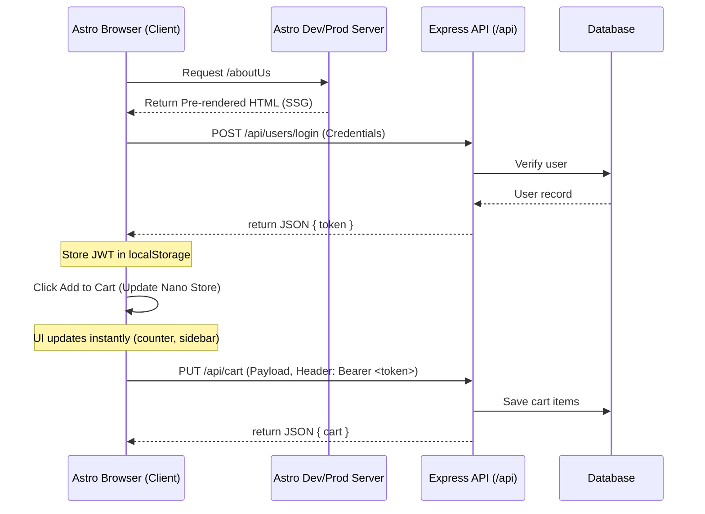

# Design: Migrate EJS to Astro

## 1. Technical Approach
We decouple the presentation layer of Mundo-3D from the Express backend by introducing a **Split Monorepo** architecture. The Express backend is refactored into a headless JSON REST API, while a new Astro application is bootstrapped inside the `/frontend` directory. 
Astro will pre-render static pages (`/aboutUs`, `/terms`, etc.) using Static Site Generation (SSG) at build time, and dynamically fetch products and user state from the Express API at runtime.

## 2. Architecture Decisions

### Monorepo Structure
- The root of the repository houses the Express API and backend dependencies.
- A new `/frontend` folder is created containing the Astro project, its own `package.json`, and dependencies.

### Bearer JWT Authentication
- Session-based cookies are replaced by stateless JSON Web Tokens (JWT).
- The Astro client requests login/register, receives a JWT, and stores it (e.g., in localStorage).
- Every protected API request attaches the token in the `Authorization: Bearer <JWT>` header.
- Express validates the token using JWT authentication middleware.

### Nano Stores Client Cart
- Cart state is managed reactively on the client side using **Nano Stores** (`nanostores`).
- Adding/removing items updates the local store immediately for instant UI response.
- Local updates trigger background async `fetch` requests to `/api/cart` to sync with the server.

### Image Upload via Fetch
- Multipart image uploads are sent from the Astro frontend using client-side `fetch` (with `FormData`).
- Express parses the request using the parameterized `upload` multer factory, validating file format/size constraints, and returns a JSON response rather than rendering HTML error pages.

## 3. Data Flow Diagram



## 4. File Changes

### Created Files
- `frontend/*`: Complete Astro codebase (pages, components, layouts, public static files).
- `frontend/src/layouts/Layout.astro`: Astro base layout. Imports global Vanilla CSS.
- `frontend/src/pages/index.astro`, `aboutUs.astro`, `faq.astro`, `help.astro`, `privacy.astro`, `step-by-step.astro`, `terms.astro`, `login.astro`, `register.astro`.
- `frontend/src/store/cart.ts`: Nano store for cart state and sync logic.
- `src/infrastructure/routes/api/cart.ts`: New REST API routes for cart sync.
- `src/infrastructure/controllers/CartApiController.ts`: New API controller for cart REST endpoints.

### Modified Files
- `src/app.js`: Remove EJS configuration, session middleware, CSRF cookie-based middleware, and old HTML rendering routes. Configure CORS to accept requests from the Astro domain.
- `src/infrastructure/routes/api/users.ts`: Add registration REST endpoint.
- `src/infrastructure/controllers/UserApiController.ts`: Add registration and profile controller methods.
- `src/infrastructure/middlewares/auth.ts`: Update `apiAuthMiddleware` and `adminGuard` to validate client-side Bearer tokens.
- `src/infrastructure/middlewares/upload.ts`: Configure error handling to return JSON payloads instead of rendering templates.
- `src/__tests__/`: Adapt integration tests (retargeting EJS page assertions to verify Express JSON API responses).

### Deleted Files
- `src/views/*`: Remove all EJS templates and layouts.
- `src/infrastructure/routes/staticPagesRoutes.ts`, `productRoutes.ts`, `userRoutes.ts`, `cartRoutes.ts`.
- `src/infrastructure/controllers/UserController.ts`, `ProductController.ts`, `CartController.ts`, `StaticPagesController.ts` (retire MVC controllers in favor of API controllers).

## 5. Interfaces & Contracts

### JWT Structure
```json
{
  "userId": 1,
  "email": "user@test.com",
  "category": "User",
  "idRole": 2,
  "exp": 1781280000
}
```

### POST /api/users/login
- **Request Body**: `{ "email": "user@test.com", "password": "password123" }`
- **Response (200 OK)**: `{ "token": "eyJhbGciOi..." }`
- **Response (401 Unauthorized)**: `{ "error": "El email o la contraseña no coinciden" }`

### POST /api/users/register (Multipart Form Data)
- **Request Fields**: `firstName`, `lastName`, `email`, `password`, `image` (file binary).
- **Response (201 Created)**: `{ "token": "eyJhbGciOi..." }`

### PUT /api/cart
- **Request Header**: `Authorization: Bearer <token>`
- **Request Body**: `{ "items": [{ "productId": 10, "quantity": 2 }] }`
- **Response (200 OK)**: `{ "success": true, "cart": { "items": [...], "total": 150.00 } }`

## 6. Testing Strategy
- **Unit Tests**: Mock use cases and verify individual API controllers (`UserApiController`, `ProductApiController`, `CartApiController`).
- **Integration Tests**: Retarget `src/__tests__/` to verify Express API responses (JSON formats, status codes, correct headers, error propagation).
- **Security & CORS Tests**: Ensure CORS allows configured Astro origin, and protected endpoints strictly reject missing/invalid Bearer tokens.

## 7. Migration & Rollout
1. **Phase 1**: Bootstrap Astro inside `/frontend`, link global styles, build static pages.
2. **Phase 2**: Add registration, profile, and cart endpoints to Express. Adapt middlewares.
3. **Phase 3**: Migrate controllers to JSON-only, disable EJS engine, and clean up traditional routes.
4. **Phase 4**: Implement dynamic frontend components in Astro, integrating JWT authentication and Nano Stores.
5. **Phase 5**: Retarget backend tests, run verification, and verify Astro production builds.

## 8. Open Questions
- **CSRF**: Should we remove cookie-based CSRF completely since API requests are protected by Bearer JWT tokens stored in localStorage? *(Recommendation: Yes, stateless token authorization inherently mitigates CSRF without session cookies.)*
- **Token Storage**: Where should Astro store the JWT? *(Recommendation: LocalStorage is sufficient for this SPA/SSG hybrid layout since we use Bearer authentication, but local Secure cookies can be considered as a fallback.)*
