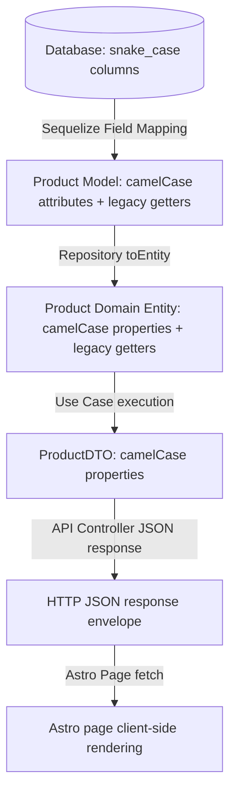

# Technical Design: Standardize Naming Conventions for Product Model (Slice 2B)

## Technical Approach

To standardize naming conventions in `mundo-3d`, we will map snake_case database columns to camelCase JavaScript/TypeScript properties for the core `Product` model.

1. **Database Schema Renaming**: Update the `Product` table column names to snake_case: `id_product`, `name_product`, `price`, `description_product`, `image`, `id_category`, `id_franchise`.
2. **Sequelize Field Mapping**: Configure `src/database/models/Product.js` attributes in camelCase, using the `field` property to map to their respective snake_case database columns.
3. **Legacy Compatibility Getters**: Define legacy PascalCase getter methods on the Sequelize model and the domain `Product` entity (e.g., `IDProduct`, `NameProduct`, `Price`, `DescriptionProduct`, `Image`, `IDCategory`, `IDFranchise`) to prevent breaking existing dependencies.
4. **Association Mapping**: Explicitly map `ShoppingCart.js` foreign key `IDProduct` to the database column `id_product` via `field: 'id_product'`.
5. **Use Cases & DTOs Refactoring**: Standardize the domain entity, DTOs, and application use cases to work with camelCase properties.
6. **Astro Frontend Alignment**: Refactor Astro pages to parse the `{ count, products, countByCategory }` response envelope and consume camelCase attributes (`idProduct`, `nameProduct`, `price`, etc.).

## Architecture Decisions

- **Property Casing Pattern**: Use standard camelCase for application runtime properties and DTO interfaces, matching target conventions.
- **Incremental Migration (Legacy Getters)**: Retaining legacy getters on the model and domain entity ensures backward compatibility, preventing a full rewrite of yet-to-be-migrated areas.

## Data Flow



## File Changes

### Models & Mappings
- **[Product.js](file:///home/ginopc/Desarrollo/Mundo-3D/src/database/models/Product.js)**: Change attributes to camelCase (`idProduct`, `nameProduct`, `price`, `descriptionProduct`, `image`). Set corresponding `field` values. Add getter methods.
- **[ShoppingCart.js](file:///home/ginopc/Desarrollo/Mundo-3D/src/database/models/ShoppingCart.js)**: Add `field: 'id_product'` to the `IDProduct` attribute definition.
- **[db.d.ts](file:///home/ginopc/Desarrollo/Mundo-3D/src/database/models/db.d.ts)**: Refactor `ProductAttributes` and `ProductInstance` to use camelCase attributes, with optional legacy properties.

### Domain & Ports
- **[Product.ts](file:///home/ginopc/Desarrollo/Mundo-3D/src/domain/entities/Product.ts)**: Refactor constructor properties to camelCase. Expose PascalCase getters.
- **[IProductRepository.ts](file:///home/ginopc/Desarrollo/Mundo-3D/src/domain/ports/IProductRepository.ts)**: Standardize port inputs and outputs to camelCase.

### Use Cases & DTOs
- **[ProductDTO.ts](file:///home/ginopc/Desarrollo/Mundo-3D/src/application/dtos/ProductDTO.ts)**: Convert all interface attributes to camelCase.
- **[ShoppingCartDTO.ts](file:///home/ginopc/Desarrollo/Mundo-3D/src/application/dtos/ShoppingCartDTO.ts)**: Refactor nested product attributes to camelCase; map using `entity.product` camelCase properties.
- **[ListProductsUseCase.ts](file:///home/ginopc/Desarrollo/Mundo-3D/src/application/use-cases/ListProductsUseCase.ts)**: Adjust mapping and return keys to camelCase.
- **[CreateProductUseCase.ts](file:///home/ginopc/Desarrollo/Mundo-3D/src/application/use-cases/CreateProductUseCase.ts)**, **[GetLatestProductUseCase.ts](file:///home/ginopc/Desarrollo/Mundo-3D/src/application/use-cases/GetLatestProductUseCase.ts)**, **[GetProductByIdUseCase.ts](file:///home/ginopc/Desarrollo/Mundo-3D/src/application/use-cases/GetProductByIdUseCase.ts)**, **[UpdateProductUseCase.ts](file:///home/ginopc/Desarrollo/Mundo-3D/src/application/use-cases/UpdateProductUseCase.ts)**, **[SyncCartUseCase.ts](file:///home/ginopc/Desarrollo/Mundo-3D/src/application/use-cases/SyncCartUseCase.ts)**: Refactor input interfaces, property access, and output mappings.

### Infrastructure & Services
- **[SequelizeProductRepository.ts](file:///home/ginopc/Desarrollo/Mundo-3D/src/infrastructure/repositories/SequelizeProductRepository.ts)**: Refactor data mapping, creation payloads, updates, and queries.
- **[productService.js](file:///home/ginopc/Desarrollo/Mundo-3D/src/services/productService.js)**: Update attributes and return envelopes to match camelCase.

### Frontend
- **[index.astro](file:///home/ginopc/Desarrollo/Mundo-3D/frontend/src/pages/index.astro)**, **[products.astro](file:///home/ginopc/Desarrollo/Mundo-3D/frontend/src/pages/products.astro)**: Extract `resData.products` from response envelope and consume camelCase properties.
- **[product.astro](file:///home/ginopc/Desarrollo/Mundo-3D/frontend/src/pages/product.astro)**: Consume camelCase properties; map to local storage.
- **[cart.ts](file:///home/ginopc/Desarrollo/Mundo-3D/frontend/src/store/cart.ts)**: Update cart action payloads to camelCase.

## Interfaces/Contracts

```typescript
export interface ProductDTO {
  idProduct: number;
  nameProduct: string;
  price: number;
  descriptionProduct: string | null;
  image: string | null;
  idCategory: number;
  idFranchise: number;
  Category: string;
}

export interface ListProductsResponse {
  count: number;
  products: ProductDTO[];
  countByCategory: Record<string, { count: number; category: { idCategory: number } | null }>;
}
```

## Testing Strategy

- **Unit/Integration Tests**: Refactor all mocked entities, assertions, and test parameters in product-related test files (e.g. `ProductModel.test.js`, `DomainEntities.test.ts`, `SequelizeProductRepository.test.ts`, use case tests) to match the new casing.
- **Legacy Compatibility Verification**: Ensure tests verify that accessing legacy getters (e.g. `IDProduct`) continues to return correct values.

## Migration/Rollout

Reset database tables in local development environment via `npm run db:reset` or `node src/database/reset-db.js`, followed by starting the server to trigger Sequelize `sync({ alter: true })` and re-seed clean snake_case tables.

## Open Questions

None.
