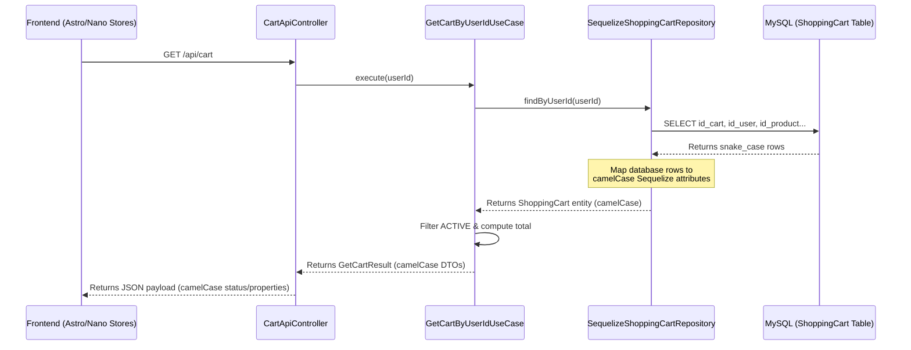

# Technical Design: Standardize Naming Conventions for ShoppingCart Model (Slice 2C)

## Technical Approach

To complete the backend naming standardization in `mundo-3d`, we will refactor the `ShoppingCart` Sequelize model to map snake_case database columns to camelCase attributes. We will:
1. Update database schema column names in `ShoppingCart` table to snake_case (`id_cart`, `id_user`, `id_product`, `quantity`, `unit_price`, `cart_status`).
2. Map Sequelize model properties directly to camelCase (`idCart`, `idUser`, `idProduct`, `quantity`, `unitPrice`, `cartStatus`).
3. Add legacy PascalCase getters on both the Sequelize model and domain entity for backward compatibility.
4. Refactor `ShoppingCartDTO` to use camelCase attributes and expose camelCase properties in client-server API payloads (`GET /api/cart`, `PUT /api/cart`).
5. Update repository methods, queries, use cases, and tests to match camelCase.

## Architecture Decisions

*   **Sequelize Field Mapping**: Explicitly define the `field` property on each model attribute in `ShoppingCart.js` (e.g., `idUser` maps to `id_user`). This maps the application layer's camelCase properties to the database's snake_case columns.
*   **Dual-Layer Legacy Getters**: Implement legacy getters (`IDCart`, `IDUser`, `IDProduct`, `Quantity`, `UnitPrice`, `CartStatus`) in both the database model (`ShoppingCart.js` getterMethods) and the domain entity (`ShoppingCart.ts` getters). This guarantees that any existing code expecting PascalCase will not break during integration.

## Data Flow



## File Changes

| File Path | Description |
|---|---|
| [ShoppingCart.js](file:///home/ginopc/Desarrollo/Mundo-3D/src/database/models/ShoppingCart.js) | Change attributes to camelCase (`idCart`, `idUser`, `idProduct`, `quantity`, `unitPrice`, `cartStatus`), configure database `field` options, add `getterMethods`. |
| [index.js](file:///home/ginopc/Desarrollo/Mundo-3D/src/database/models/index.js) | Update associations between `User`, `Product`, and `ShoppingCart` to use camelCase foreign keys (`idUser`, `idProduct`). |
| [db.d.ts](file:///home/ginopc/Desarrollo/Mundo-3D/src/database/models/db.d.ts) | Update `ShoppingCartAttributes` and `ShoppingCartInstance` to use camelCase attributes and optional legacy types. |
| [ShoppingCart.ts](file:///home/ginopc/Desarrollo/Mundo-3D/src/domain/entities/ShoppingCart.ts) | Add legacy getters (`IDCart`, `IDUser`, `IDProduct`, `Quantity`, `UnitPrice`, `CartStatus`). |
| [ShoppingCartDTO.ts](file:///home/ginopc/Desarrollo/Mundo-3D/src/application/dtos/ShoppingCartDTO.ts) | Refactor DTO attributes to camelCase; map domain entity to camelCase in `mapToShoppingCartDTO`. |
| [SequelizeShoppingCartRepository.ts](file:///home/ginopc/Desarrollo/Mundo-3D/src/infrastructure/repositories/SequelizeShoppingCartRepository.ts) | Update query parameters, associations, creation payloads, and `toEntity` mapper to camelCase. |

## Interfaces/Contracts

### DTO Response Contract (`ShoppingCartDTO`)
```typescript
export interface ShoppingCartDTO {
  idCart: number;
  idUser: number;
  idProduct: number;
  quantity: number;
  unitPrice: number;
  status: string;
  hasPriceDrift: boolean;
  product: {
    idProduct: number;
    nameProduct: string;
    price: number;
    image: string | null;
  };
}
```

### API Payload Sync (`PUT /api/cart`)
Request:
```json
{
  "items": [
    { "productId": 10, "quantity": 2 }
  ]
}
```

## Testing Strategy

1.  **Model Unit Testing**: Create `ShoppingCartModel.test.js` using Jest to assert attributes definition, snake_case mapping, and legacy getters. Update association assertions in `index.test.js`.
2.  **DTO & Domain Entity Testing**: Update `ShoppingCartDTO.test.ts` to assert camelCase JSON outputs and verification logic.
3.  **Repository & Use Case Testing**: Update mocked databases and repository assertions in `SequelizeShoppingCartRepository.test.ts` and `GetCartByUserIdUseCase.test.ts` to reflect the new camelCase schemas.
4.  **Controller Integration Testing**: Update `CartApiController.test.ts` to assert that JSON responses output camelCase keys (`idCart`, `status`, etc.).

## Migration/Rollout

*   **Database Schema Migration**: Since local development uses `sync({ alter: true })` and `npm run db:reset`, DB synchronization will automatically drop and recreate/alter the columns on the next initialization.
*   **Zero-Downtime Guard**: Legacy PascalCase getters serve as the transition path. Once the camelCase changes are fully deployed and verified, downstream consumers can be refactored, and legacy getters removed in a later cleanup phase.

## Open Questions

*   None.
