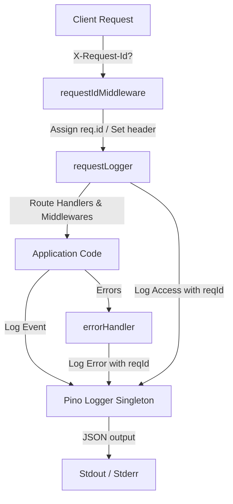

# Design: Structured Logging Refactor

This design document outlines the transition of the `Mundo-3D` Express/TypeScript application from unstructured `console` logging to structured JSON logging powered by Pino. It includes the introduction of a request-scoped correlation ID middleware to track and correlate HTTP requests across all logged context.

## 1. Component Architecture

The logging architecture consists of the following new and modified components:



### 1.1 Centralized Logger Utility (`src/infrastructure/logging/logger.ts`)

A centralized Pino logger singleton will be introduced. This module will dynamically configure the log destination, level, and format based on the running environment:

- **Production (`NODE_ENV === 'production'`)**: Emits raw JSON directly to `stdout`/`stderr` for consumption by external logging collectors.
- **Development (`NODE_ENV === 'development'` / other)**: Emits human-readable, colorized output to the terminal using `pino-pretty`.
- **Test (`NODE_ENV === 'test'`)**: Silences all logs (`silent` level) to prevent polluting Jest execution output, unless explicitly overridden via `LOG_LEVEL` environment variable.

```typescript
import pino from 'pino';

const isProduction = process.env.NODE_ENV === 'production';
const isTest = process.env.NODE_ENV === 'test';

const defaultLevel = isTest ? 'silent' : 'info';
const level = process.env.LOG_LEVEL || defaultLevel;

const logger = pino({
  level,
  ...(!isProduction && !isTest && {
    transport: {
      target: 'pino-pretty',
      options: {
        colorize: true,
        translateTime: 'SYS:standard',
        ignore: 'pid,hostname',
      },
    },
  }),
});

export default logger;
```

---

### 1.2 Correlation ID Middleware (`src/infrastructure/middlewares/requestId.ts`)

This middleware intercepts incoming HTTP requests to trace request execution path:
- Read correlation ID from the `X-Request-Id` request header (case-insensitive).
- If absent, generate a unique ID using `crypto.randomUUID()`.
- Attach the ID to the `Request` object (`req.id`).
- Set the `X-Request-Id` header in the HTTP response.

To ensure TypeScript type safety, we extend the Express `Request` interface via declaration merging.

```typescript
import { Request, Response, NextFunction } from 'express';
import crypto from 'crypto';

declare global {
  namespace Express {
    interface Request {
      id?: string;
    }
  }
}

export const requestIdMiddleware = (req: Request, res: Response, next: NextFunction): void => {
  const existingId = req.headers['x-request-id'];
  const reqId = Array.isArray(existingId)
    ? existingId[0]
    : (existingId || crypto.randomUUID());

  req.id = reqId;
  res.setHeader('X-Request-Id', reqId);
  next();
};

export default requestIdMiddleware;
```

---

### 1.3 Request Logger Middleware (`src/infrastructure/middlewares/requestLogger.ts`)

A lightweight custom middleware will replace `morgan('dev')` for logging HTTP requests:
- Records the request start time using `performance.now()`.
- Registers a listener on the response `'finish'` event.
- Calculates response latency in milliseconds.
- Writes a structured log statement including: `reqId`, `method`, `url`, `status`, and `responseTime`.

```typescript
import { Request, Response, NextFunction } from 'express';
import logger from '../logging/logger';

export const requestLogger = (req: Request, res: Response, next: NextFunction): void => {
  const start = performance.now();

  res.on('finish', () => {
    const responseTime = parseFloat((performance.now() - start).toFixed(3));
    
    logger.info({
      reqId: req.id,
      method: req.method,
      url: req.originalUrl || req.url,
      status: res.statusCode,
      responseTime
    }, `HTTP ${req.method} ${req.originalUrl || req.url} ${res.statusCode} - ${responseTime}ms`);
  });

  next();
};

export default requestLogger;
```

---

## 2. Integration and Migration

### 2.1 Middleware Registration (`src/app.js`)

We will replace `morgan('dev')` with the new trace logging stack.
- The `requestIdMiddleware` must run **first** in the logging chain, followed immediately by `requestLogger`.
- Remove `const morgan = require('morgan');` to prevent unused imports and linter errors.

```javascript
// Register correlation & request logging
const requestIdMiddleware = require('./infrastructure/middlewares/requestId').default;
const requestLogger = require('./infrastructure/middlewares/requestLogger').default;

// Replace morgan('dev')
server.use(requestIdMiddleware);
server.use(requestLogger);
```

### 2.2 Centralized Error Handler (`src/infrastructure/middlewares/errorHandler.ts`)

Update the error handler to:
- Extract `req.id` and pass it as `reqId` in the structured log.
- Log error details (`message`, `stack`, custom properties) via `logger.error` instead of `console.error`.
- Append `reqId` in the JSON response payload.

```typescript
import { Request, Response, NextFunction } from 'express';
import logger from '../logging/logger';

interface HttpError extends Error {
  status?: number;
  statusCode?: number;
}

const errorHandler = (err: HttpError, req: Request, res: Response, _next: NextFunction): void => {
  const reqId = req.id;

  logger.error({
    reqId,
    err: {
      message: err.message,
      stack: err.stack,
      name: err.name,
      status: err.status || err.statusCode
    }
  }, err.message || 'Internal Server Error');

  let statusCode = err.status || err.statusCode || 500;
  let message = err.message || 'Internal Server Error';

  if (err.name === 'MulterError' || err.message === 'Invalid file format or size limit exceeded') {
    statusCode = 400;
    message = 'Invalid file format or size limit exceeded';
  } else if (process.env.NODE_ENV === 'production') {
    message = 'Algo salió mal. Intente nuevamente más tarde.';
  }

  res.status(statusCode).json({
    error: message,
    reqId,
    ...(process.env.NODE_ENV !== 'production' && { stack: err.stack }),
  });
};

export default errorHandler;
```

### 2.3 Other Middlewares

- **`cartCount.ts`**: Replace `console.error` with `logger.error` including `reqId: req.id`.
- **`userLogged.ts`**: Replace `console.error` with `logger.error` including `reqId: req.id`.

---

## 3. Testing Strategy

### 3.1 Unit Testing for Logger / Middlewares
- **`requestId.ts`**: Test that requests with incoming `X-Request-Id` headers reuse the value, and requests without a header get a UUID assigned. Ensure response headers include `X-Request-Id`.
- **`requestLogger.ts`**: Mock `logger.info` and ensure the access log payload contains the correct properties (`reqId`, `method`, `url`, `status`, `responseTime`).

### 3.2 Error Handler Tests (`errorHandler.test.ts`)
- Replace the `console.error` spy with a `jest.spyOn(logger, 'error')` spy.
- Assert that `logger.error` is triggered with the correct structured error parameters and correlation `reqId`.
- Assert that the response JSON payload includes the `reqId`.

---

## 4. Administrative Scripts exclusion

- **`src/database/seed.js`** and **`src/database/reset-db.js`** are out of scope. They are node scripts designed for raw terminal logging, and will continue to use standard `console.log`/`console.error` directly.
