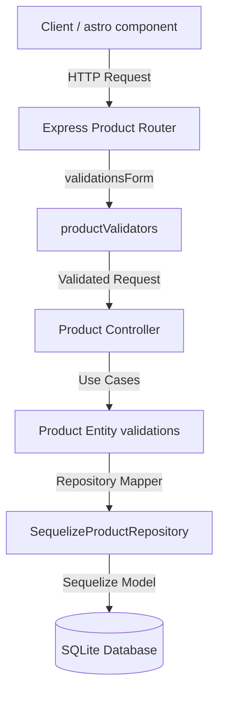

# Technical Design: Specialize Mundo-3D for 3D Printing

This document outlines the technical design decisions, architecture mapping, and layout changes to specialize Mundo-3D for custom 3D printing items.

---

## 1. Architectural Decisions

### 1.1 Direct Attributes on Product Entity
To avoid join overhead and extra queries for product details, we add 3D specifications (`material`, `height`, `width`, `depth`, `finish`, `productionTime`) as optional first-class attributes directly on the `Product` entity and the database schema.
- **Allowed Materials**: Validated to be one of `'PLA'`, `'Resina'`, `'PETG'`, `'Flex'`, or any string starting with `'Otros: '` (e.g. `'Otros: ABS'`).
- **Allowed Finish**: Nullable string representing the post-processing finish (e.g., `'Pintado a mano'`).

### 1.2 Dimensions Validation and Fallback Logic
- **Domain Layer**: Validation ensures `height`, `width`, and `depth` are non-negative decimal numbers.
- **Frontend Layer**: To present clean information without breaking layouts when data is partially provided:
  - If **at least one** dimension is defined (i.e. not `null`, not `undefined`, and not `0`):
    - Any defined dimension formats as `"${val} cm"`.
    - Any missing dimension (or `0`) formats as `"no definida"`.
    - UI string output under `#product-dimensions` maps to: `H: <height> | W: <width> | D: <depth>` (e.g. `H: 12 cm | W: no definida | D: no definida`).
  - If **all** dimensions are undefined/null/0:
    - They fallback to `"A consultar"`.
    - UI string output under `#product-dimensions` maps to: `"A consultar"`.

### 1.3 Production Time Constraints
- `productionTime` must be a positive integer representing days.
- Maximum constraint: Must not exceed `30` days.

### 1.4 Database Auto-Sync
- Database initialization in `backend/index.js` syncs models with the SQLite database via `db.sequelize.sync({ alter: true })`.
- This handles schema migrations automatically without requiring manual SQL migration scripts.

---

## 2. Affected Files and Proposed Changes

### 2.1 Backend Domain & Application Layers

#### [Product.ts](file:///home/ginopc/Desarrollo/Mundo-3D/backend/src/domain/entities/Product.ts)
- **Status**: Modified.
- **Changes**:
  - Enforce material constraints in constructor: `PLA`, `Resina`, `PETG`, `Flex`, or prefix `'Otros: '`.
  - Validate `productionTime` range: `productionTime >= 1` and `productionTime <= 30`.
  - Validate dimensions: `height >= 0`, `width >= 0`, `depth >= 0`.
  - Expose getters: `Material`, `Height`, `Width`, `Depth`, `Finish`, `ProductionTime`.

#### [ProductDTO.ts](file:///home/ginopc/Desarrollo/Mundo-3D/backend/src/application/dtos/ProductDTO.ts)
- **Status**: Modified.
- **Changes**:
  - Add optional/nullable properties to the transport interface.

---

### 2.2 Backend Database & Infrastructure Layers

#### [Product.js](file:///home/ginopc/Desarrollo/Mundo-3D/backend/src/database/models/Product.js)
- **Status**: Modified.
- **Changes**:
  - Map new database fields:
    - `material` -> `material` (String, nullable)
    - `height` -> `height` (Decimal, nullable)
    - `width` -> `width` (Decimal, nullable)
    - `depth` -> `depth` (Decimal, nullable)
    - `finish` -> `finish` (String, nullable)
    - `productionTime` -> `production_time` (Integer, nullable)
  - Configure getters to support PascalCase attributes mapping.

#### [db.d.ts](file:///home/ginopc/Desarrollo/Mundo-3D/backend/src/database/models/db.d.ts)
- **Status**: Modified.
- **Changes**:
  - Update `ProductAttributes` and `ProductInstance` to type-check the new 3D attributes.

#### [SequelizeProductRepository.ts](file:///home/ginopc/Desarrollo/Mundo-3D/backend/src/infrastructure/repositories/SequelizeProductRepository.ts)
- **Status**: Modified.
- **Changes**:
  - Populate 3D properties in the mapping method `toEntity`.
  - Pass 3D properties in `create` and `update` methods.

#### [productValidators.ts](file:///home/ginopc/Desarrollo/Mundo-3D/backend/src/infrastructure/middlewares/validators/productValidators.ts)
- **Status**: Modified.
- **Changes**:
  - Add `express-validator` rules inside `validationsForm` chain:
    - `material`: optional, must match allowed list or start with `'Otros: '`.
    - `height`, `width`, `depth`: optional, must be numeric and non-negative.
    - `finish`: optional.
    - `productionTime`: optional, must be an integer between 1 and 30.

---

### 2.3 Frontend Adapters & Components

#### [product.adapter.ts](file:///home/ginopc/Desarrollo/Mundo-3D/frontend/src/domains/products/adapters/product.adapter.ts)
- **Status**: Modified.
- **Changes**:
  - Implement dimension fallback logic: check if any of height/width/depth is defined and non-zero. If so, map defined ones to `"<val> cm"` and undefined/null/0 ones to `"no definida"`. If none are defined, map all to `"A consultar"`.
  - Format `productionTime` as `"${val} días"` or `"A consultar"`.
  - Default `material` and `finish` to `"A consultar"`.

#### [product.astro](file:///home/ginopc/Desarrollo/Mundo-3D/frontend/src/pages/product.astro)
- **Status**: Modified.
- **Changes**:
  - Include `.product-specs` panel in page layout with a table displaying material, dimensions, finish, and production time.
  - Fix client-side script handling of the `#product-dimensions` value: format as `H: ${product.height} | W: ${product.width} | D: ${product.depth}` when at least one is not `"A consultar"`, otherwise display `"A consultar"`.

#### [DB.md](file:///home/ginopc/Desarrollo/Mundo-3D/DB.md)
- **Status**: Out of sync (Needs update).
- **Changes**:
  - Document the updated table structure.

---

## 3. Data Flow Diagram

